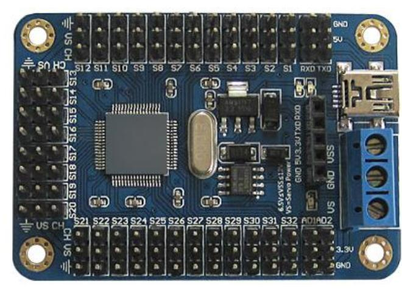

#HexadServos

Arduino library for 16/32 servo controller. The communication with the MCU on the controller is done using a software serial

** References are in the `attachements` folder **



## Usage

- Create a HexdServos object
- Write the data to `servoNumber` giving it an `angle` and optionally a `speed`
- Angles range from `0~180`
- Speeds range from `0~100`

```Arduino
#include "HexdServos.hpp"
#include <Arduino.h>

const int rxPin = 10;
const int txPin = 11;
const int servoDelay = 200;
HexdServos servos(rxPin, txPin, 9600);

void setup() { servos.begin(); }

void loop() {
  for (int i = 180; i >= 0; i -= 45) {
    servos.servoWrite(1, i);
    delay(servoDelay);
  }

  for (int i = 0; i < 180; i += 45) {
    servos.servoWrite(1, i);
    delay(servoDelay);
  }
}
```
